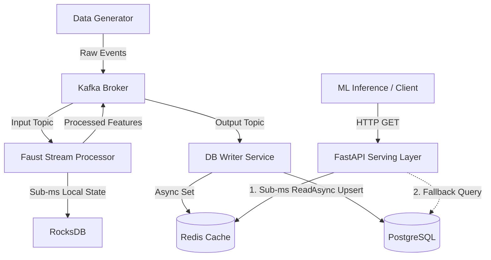

# Real-Time Feature Engineering Pipeline

A production-grade, event-driven feature store built with **Kafka**, **Faust**, **Redis**, **PostgreSQL**, and **FastAPI**.

## System Overview

This system ingests high-frequency raw events, calculates stateful features in real-time (Rolling Windows & Counts), and utilizes a **dual-storage strategy** to serve those features to machine learning models with sub-millisecond latency while maintaining strict historical consistency.

### Architecture



---

## Core Features

* **Dual-Storage Serving Strategy**: Utilizes **Redis** as a high-speed, in-memory cache for sub-millisecond feature retrieval, alongside **PostgreSQL** as the durable system of record for historical consistency.

* **Asynchronous Data Synchronisation**: The database writer consumes processed events from Kafka and concurrently updates both Redis and Postgres, ensuring zero-latency impact on the live inference read-path.

* **Real-Time Stream Processing**: Faust agents process high-throughput events utilizing embedded RocksDB for ultra-fast, local windowed aggregations without network bottlenecking.

* **Idempotent Architecture**: Guaranteed exactly-once processing semantics through Kafka offsets and PostgreSQL Upserts (`ON CONFLICT DO UPDATE`), preventing data corruption during worker crashes.

* **Graceful Degradation**: The FastAPI serving layer implements a Cache-Aside pattern. If the Redis cluster experiences downtime, the API seamlessly falls back to querying PostgreSQL directly.

* **Containerized Infrastructure**: Fully reproducible, locally testable environment using Docker Compose.

---

## Setup & Running

### Prerequisites

* Docker & Docker Compose
* Ports `8000` (API), `9092` (Kafka), `5432` (Postgres), and `6379` (Redis) must be available on your host machine.

### Quick Start

#### 1. Configure Environment

Clone the repository and set up your environment variables.

```bash
cp .env.example .env
```

#### 2. Start the Cluster

Spin up the entire event-driven architecture in the background.

```bash
docker compose up -d --build
```

#### 3. Verify Health

Ensure all containers (`zookeeper`, `kafka`, `postgres`, `redis`, `db_writer`, `faust_app`, `fastapi_app`, `data_generator`) are running.

```bash
docker compose ps
```

---

## Validating the Pipeline

### 1. Check Data Generation

The `data_generator` service pumps continuous simulated traffic into Kafka. You can watch the events being produced:

```bash
docker compose logs -f data_generator
```

### 2. Query the Feature Store API

Fetch real-time features for a specific user. Look at the data generator logs to find an active `user_id`, then query the API. This endpoint will hit Redis for sub-millisecond retrieval.

```bash
curl http://localhost:8000/features/<USER_ID>
```

### Example Response

```json
{
  "user_id": "b13a9739-dd2a-4fd4-a1dc-8525073e9ff5",
  "feature_a": {
    "sum_10s": 123.45
  },
  "feature_b": 5,
  "last_updated_timestamp": "2024-05-14T08:30:00.123456"
}
```

---

## Testing

The project uses a containerized testing strategy to ensure tests run in an identical environment to production.

### Run the Full Test Suite

1. Ensure the main cluster is already running:

```bash
docker compose up -d
```

2. Run the test container:

```bash
docker compose run --rm tests
```

This executes both integration and unit tests inside an isolated container environment.

---

## Operational Debugging

### Redis Monitoring

Watch asynchronous synchronization and real-time cache updates:

```bash
docker compose exec redis redis-cli
127.0.0.1:6379> MONITOR
```

### Kafka Topics

Inspect the raw and processed Kafka streams:

```bash
docker compose exec kafka kafka-topics.sh --list --bootstrap-server localhost:9092
```

### PostgreSQL Verification

Verify persisted historical feature data:

```bash
docker compose exec postgres psql -U admin -d feature_store
```

---

## Performance Tuning

### Throughput Scaling

Adjust event generation rate in `.env`:

```env
EVENTS_PER_SECOND=1000
```

### Window Aggregation Tuning

Modify aggregation window sizes in:

```bash
services/faust_app/config.py
```

### Horizontal Scaling

Scale Faust workers in `docker-compose.yml`.

> Note: Increasing worker count requires increasing Kafka topic partitions (`raw_events` and `processed_features`) to enable parallel stream consumption.

---

## Tech Stack

| Component | Purpose |
|---|---|
| Kafka | Event Streaming Backbone |
| Faust | Stateful Stream Processing |
| RocksDB | Embedded Local State Store |
| Redis | Low-Latency Feature Cache |
| PostgreSQL | Durable Historical Storage |
| FastAPI | Online Feature Serving API |
| Docker Compose | Local Orchestration |

---

## Production Design Highlights

* Event-driven asynchronous architecture
* Sub-millisecond online feature serving
* Stateful stream processing with RocksDB
* Cache-aside resiliency pattern
* Exactly-once/idempotent persistence
* Horizontally scalable Kafka consumer topology
* Fully containerized reproducible infrastructure