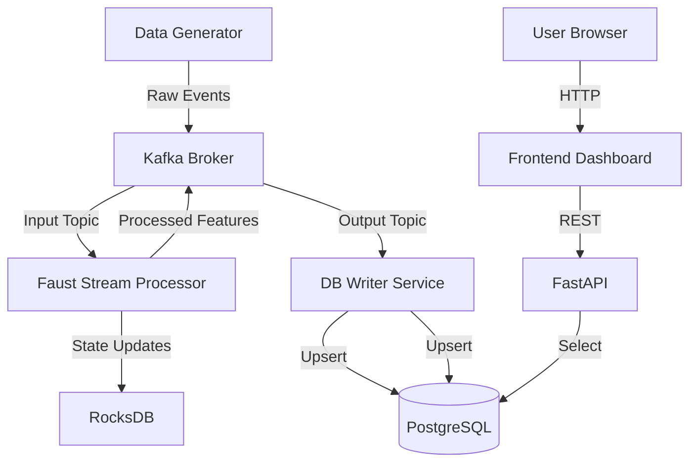

# Real-Time Feature Engineering Pipeline

A production-grade, event-driven feature store built with **Kafka**, **Faust**, **PostgreSQL**, and **FastAPI**.

## System Overview

This system ingests high-frequency raw events, calculates stateful features in real-time (Rolling Windows & Counts), and persists them for sub-millisecond retrieval.

### Architecture



## Features

- **Real-Time Processing**: Faust agents process events with windowed aggregations.
- **State Management**: RocksDB handles local state for high performance.
- **Idempotent Writes**: Postgres Upserts ensure consistency.
- **Event-Driven**: Fully asynchronous pipeline.
- **Real-Time Dashboard**: Live visualization of feature updates.
- **User Discovery**: Auto-detection of active users in the stream.
- **Containerized**: All services are Dockerized.

## Setup & Running

### Prerequisites
- Docker & Docker Compose
- Ports 8000, 9092, 5432 available.

### Quick Start

1. **Configure Environment**:
   ```bash
   cp .env.example .env
   ```

2. **Start Services**:
   ```bash
   docker-compose up --build -d
   ```

3. **Verify Status**:
   ```bash
   docker-compose ps
   ```

4. **Watch Logs**:
   ```bash
   docker-compose logs -f faust_app
   ```

## Validating the Pipeline

### 1. Check Data Generation
The `data_generator` service should be sending 1000 events/sec. Check logs:
```bash
docker-compose logs -f data_generator
```

### 2. Query the API
Fetch features for a user (replace UUID with one found in logs):
```bash
curl http://localhost:8000/features/<USER_ID>
```
Response:
```json
{
  "user_id": "...",
  "feature_a": {"sum_10s": 123.45},
  "feature_b": 5,
  "last_updated_timestamp": "..."
}
```

## Testing

Run the full test suite (integration + unit) using the helper container:
```bash
docker compose run --rm tests
```
This handles all dependency installation and configuration automatically.

## Debugging

- **Kafka Issues**: Use `docker-compose exec kafka kafka-topics.sh --list --bootstrap-server localhost:9092` to check topics.
- **DB Issues**: Connect via `docker-compose exec postgres psql -U admin -d feature_store`.

## Performance Tuning
- Adjust `EVENTS_PER_SECOND` in `.env`.
- Tune `WINDOW_SIZE` in `services/faust_app/config.py`.
- Scale workers in `docker-compose.yml` (requires partitioning strategy updates).
